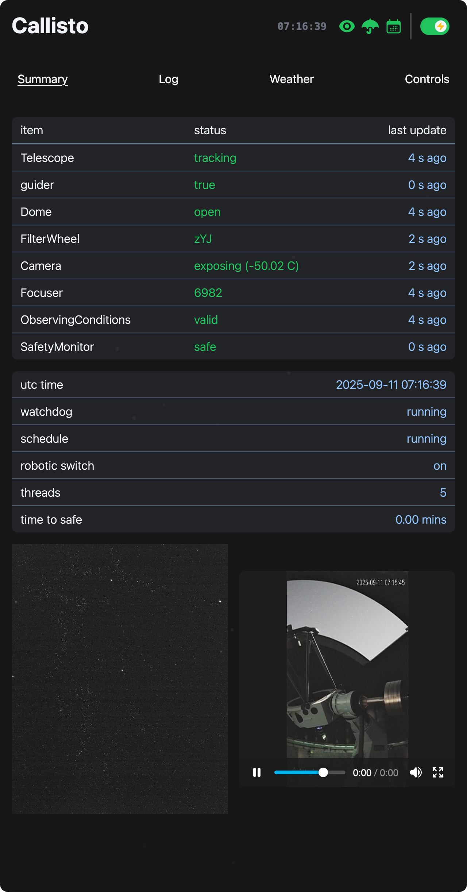
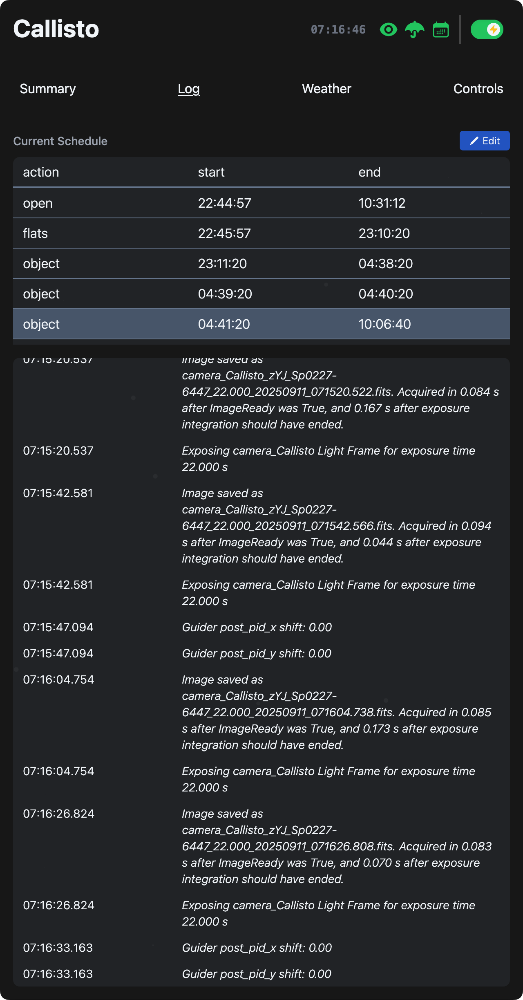
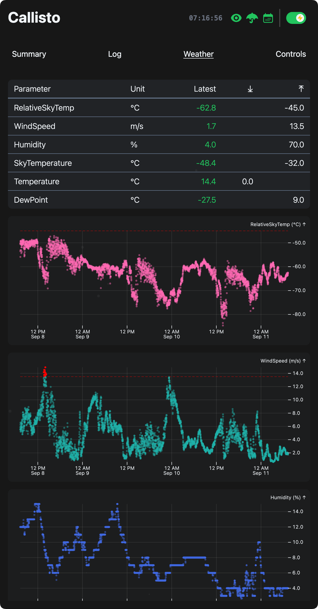
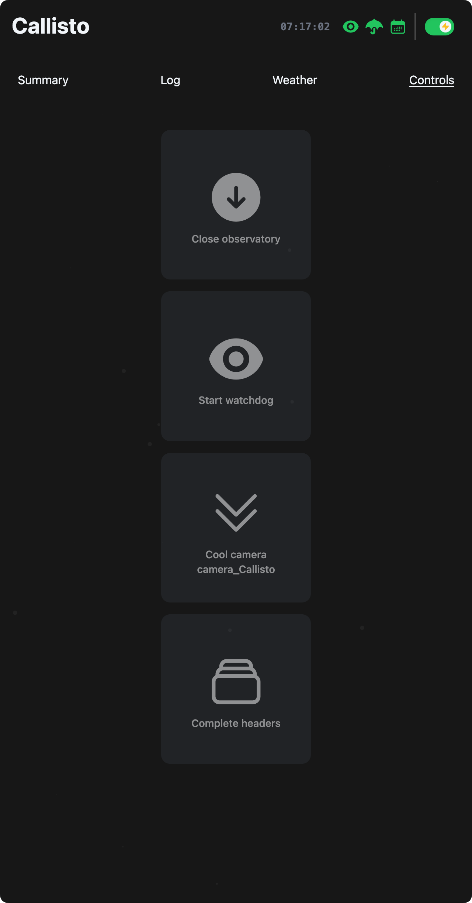
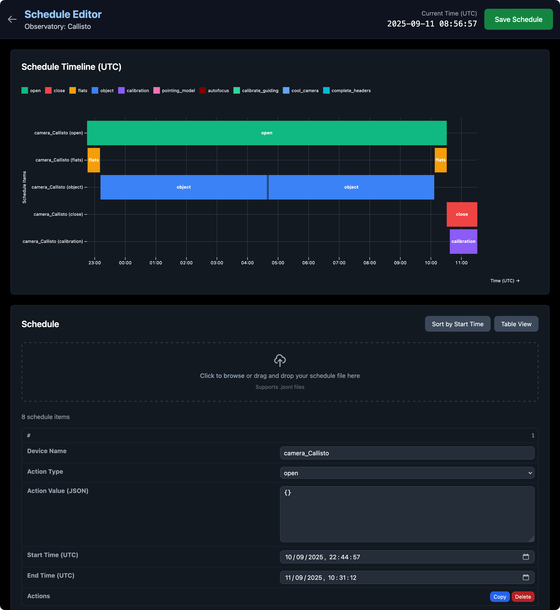

# Astra
**Automated Survey observaTory Robotised with Alpaca**

Astra is an open-source observatory control software designed for automating and managing the operations of a survey observatory. It is built to work seamlessly with ASCOM Alpaca.

<!-- ## Why Astra?

**Already powering observatories across the globe:**
- SPECULOOS-South (Paranal, Chile)
- Saint-Ex (San Pedro Mártir, Mexico)  
- ETH Observatory (Zurich, Switzerland) -->

## Key Features

- **Fully Autonomous** - Set your schedule and let Astra handle the rest 
- **ASCOM Alpaca** - Works with all your existing equipment  
- **Multi-Platform** - Windows, Linux, macOS support  
- **Web Interface** - Control your observatory from your browser
- **Production Ready** - Battle-tested in real observatories

## Getting Started

**📖 Complete setup instructions available in our documentation:**

- **[Installation Guide](https://docs.withastra.io/installation)** - Step-by-step installation instructions
- **[Getting Started](https://docs.withastra.io/getting_started)** - First-time setup and configuration
- **[Full Documentation](https://docs.withastra.io/)** - Complete user guide and API reference

Once installed, open http://localhost:8000 in your browser to access Astra's web interface.

## Screenhots

<table>
  <tr>
    <td width="50%">
      
      
<em>Observatory status overview</em>

    </td>
    <td width="50%">
      
      
<em>System logs</em>

    </td>
  </tr>
  <tr>
    <td width="50%">
      
      
<em>Weather monitoring</em>

    </td>
    <td width="50%">
      
      
<em>Equipment control panel</em>

    </td>
  </tr>
</table>

  
  
<em>Interactive schedule planning</em>

## Contributing

We welcome contributions! See [CONTRIBUTING.md](CONTRIBUTING.md) for guidelines.

## License

GNU General Public License v3.0 - see [LICENSE](LICENSE) for details.

## Support

- [Documentation](https://docs.withastra.io/)
- [Issues](https://github.com/ppp-one/astra/issues)

---
*Built with care for the astronomical community*
