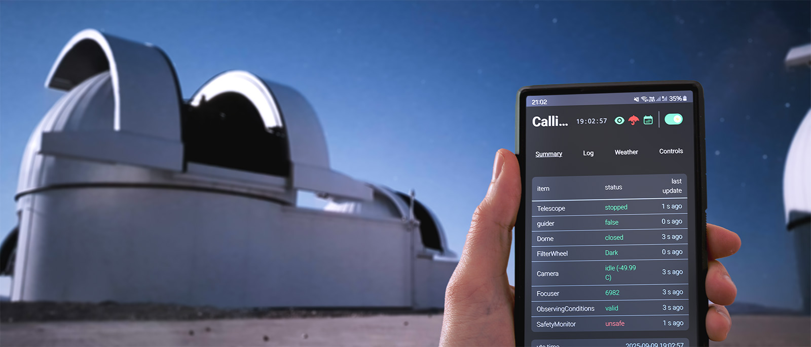

# Astra

[](LICENSE)
[](https://www.python.org/downloads/)
[](https://github.com/astral-sh/uv)

[](https://docs.withastra.io/)

Astra (**Automated Survey observaTory Robotised with Alpaca**) is an open-source observatory control software for automating and managing robotic observatories. It integrates seamlessly with [ASCOM Alpaca](https://ascom-standards.org/api/) for hardware control.



---

## Features

- **Fully Robotic** — Schedule once, observe automatically with error and bad weather handling
- **ASCOM Alpaca** — Compatible with your existing ASCOM equipment  
- **Cross-Platform** — Python based, runs on Windows, Linux, macOS  
- **Web Interface** — Manage your observatory from any browser, use [cloudflared](https://developers.cloudflare.com/cloudflare-one/connections/connect-networks/get-started/) or similar to access outside your network
- **[Comprehensive Docs](https://docs.withastra.io/)** — Setup, usage, and module reference  

---

## Screenshots

<table>
  <tr>
    <td width="24%">
      
      <p align="center"><em>Observatory overview</em></p>
    </td>
    <td width="24%">
      
      <p align="center"><em>System logs</em></p>
    </td>
    <td width="24%">
      
      <p align="center"><em>Weather monitoring</em></p>
    </td>
    <td width="24%">
      
      <p align="center"><em>Controls tab</em></p>
    </td>
  </tr>
</table>

---

## Contributing

Contributions are welcome. See [CONTRIBUTING.md](CONTRIBUTING.md) or the [contributing guide](https://docs.withastra.io/contributing).

---

## License

Released under the [GNU GPL v3](LICENSE).

---

## Support

- [Documentation](https://docs.withastra.io/)  
- [Issue Tracker](https://github.com/ppp-one/astra/issues)  

---

## Citation

If you use Astra in published research, please cite it as:
```
@software{Pedersen_Astra,
author = {Pedersen, Peter P. and Degen, David and Garcia, Lionel and Zúñiga-Fernández, Sebastián and Sebastian, Daniel and Schroffenegger, Urs and Queloz, Didier},
license = {GPL-3.0},
title = {{Astra}},
url = {https://github.com/ppp-one/astra}
}
```
