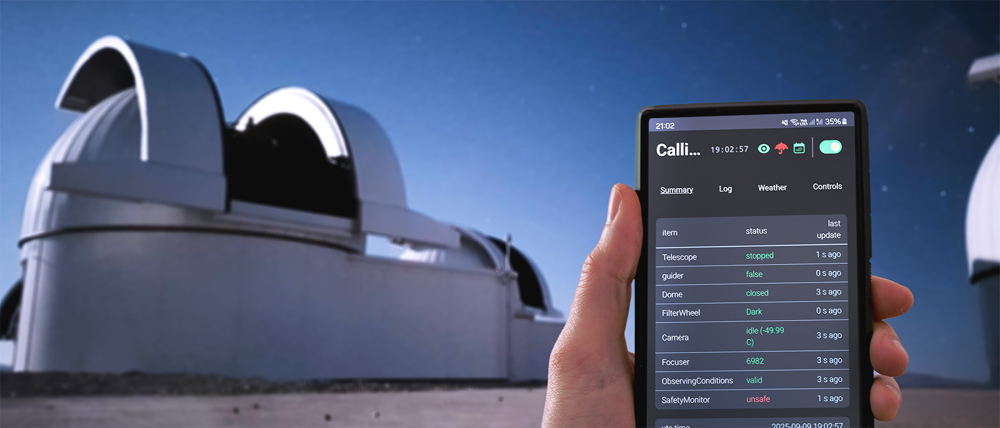
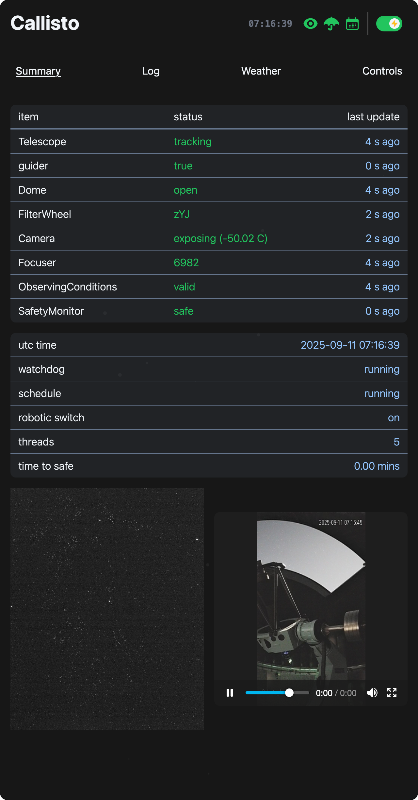
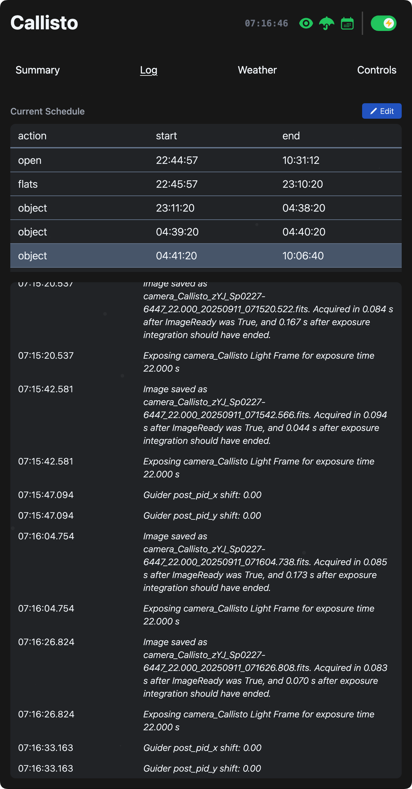
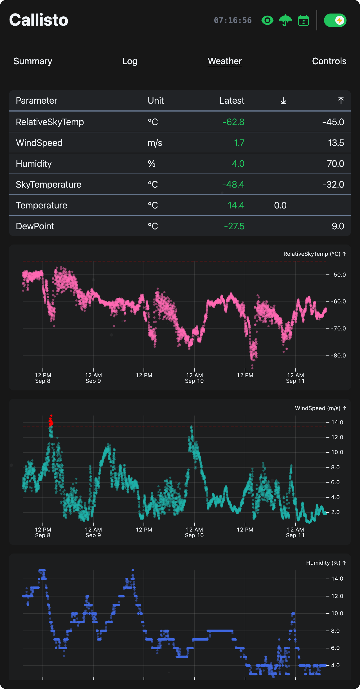
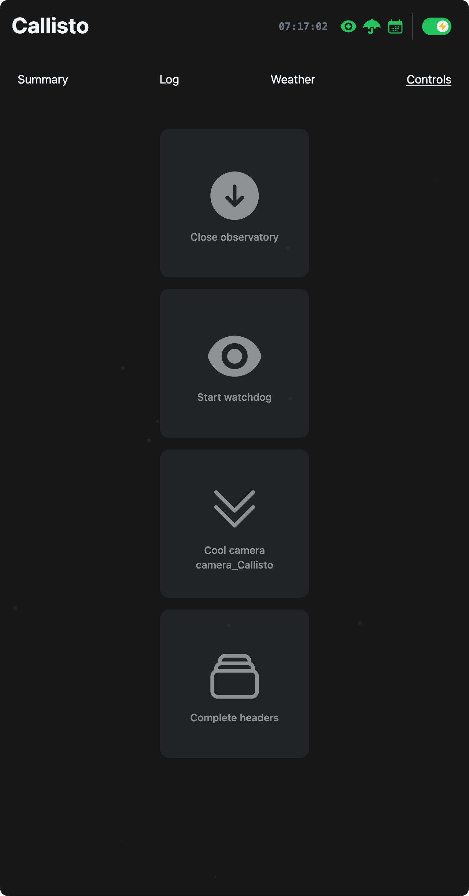

# Astra

[](LICENSE)
[](https://www.python.org/downloads/)
[](https://github.com/astral-sh/uv)

[](https://docs.withastra.io/)

Astra (**Automated Survey observaTory Robotised with Alpaca**) is an open-source observatory control software for automating and managing robotic observatories. It integrates seamlessly with [ASCOM Alpaca](https://ascom-standards.org/api/) for hardware control.



---

## Features

- **Fully Robotic** — Schedule once, observe automatically with error and bad weather handling
- **ASCOM Alpaca** — Compatible with your existing ASCOM equipment  
- **Cross-Platform** — Python based, runs on Windows, Linux, macOS  
- **Moving Targets** — Non-sidereal tracking of planets, comets, asteroids, and satellites from TLEs  
- **Web Interface** — Manage your observatory from any browser, use [cloudflared](https://developers.cloudflare.com/cloudflare-one/connections/connect-networks/get-started/) or similar to access outside your network
- **[Comprehensive Docs](https://docs.withastra.io/)** — Setup, usage, and module reference  

---

## Screenshots

<table>
  <tr>
    <td width="24%">
      
      <p align="center"><em>Observatory overview</em></p>
    </td>
    <td width="24%">
      
      <p align="center"><em>System logs</em></p>
    </td>
    <td width="24%">
      
      <p align="center"><em>Weather monitoring</em></p>
    </td>
    <td width="24%">
      
      <p align="center"><em>Controls tab</em></p>
    </td>
  </tr>
</table>

---

## Contributing

Contributions are welcome. See [CONTRIBUTING.md](CONTRIBUTING.md) or the [contributing guide](https://docs.withastra.io/contributing).

---

## License

Released under the [GNU GPL v3](LICENSE).

---

## Support

- [Documentation](https://docs.withastra.io/)  
- [Issue Tracker](https://github.com/ppp-one/astra/issues)  

---

## Citation

If you use Astra in published research, please cite it as:

```bibtex
@misc{https://doi.org/10.5281/zenodo.18890151,
  doi = {10.5281/ZENODO.18890151},
  url = {https://zenodo.org/doi/10.5281/zenodo.18890151},
  author = {Pedersen,  Peter P. and Degen,  David and Garcia,  Lionel and Zúñiga-Fernández,  Sebastián and Sebastian,  Daniel and Schroffenegger,  Urs and Queloz,  Didier},
  keywords = {observatory control software,  ocs,  astronomy,  control software,  ground-based,  telescope,  camera,  ascom,  survey telescope,  photometry,  imaging},
  title = {Astra},
  publisher = {Zenodo},
  year = {2026},
  copyright = {GNU General Public License v3.0 only}
}
```

and

```bibtex
@inproceedings{10.1117/12.3105437,
  author = {Peter P. Pedersen and David Degen and Lionel Garcia and Urs Schroffenegger and Daniel Sebastian and Sebasti{\'a}n Z{\'u}{\~n}iga-Fern{\'a}ndez and Brice-Olivier Demory and Elsa Ducrot and Micha{\"e}l Gillon and Matthew J. Hooton and Cl{\`a}udia Jan{\'o}-Mu{\~n}oz and James McCormac and Mathilde Timmermans and Amaury H. M. J. Triaud and Didier Queloz},
  title = {{Astra: an open-source fully autonomous robotic observatory control software}},
  volume = {14155},
  booktitle = {Software and Cyberinfrastructure for Astronomy IX},
  editor = {Jorge Ibsen and Valentina Alberti},
  organization = {International Society for Optics and Photonics},
  publisher = {SPIE},
  pages = {141552U},
  keywords = {observatory control software, robotic, ground-based, observatory, robotic astronomy, plate solving, autoguiding, autofocus},
  year = {2026},
  doi = {10.1117/12.3105437},
  URL = {https://doi.org/10.1117/12.3105437}
}
```

Zenodo DOI: [10.5281/zenodo.18890151](https://doi.org/10.5281/zenodo.18890151), Proceedings DOI: [10.1117/12.3105437](https://doi.org/10.1117/12.3105437), Arxiv DOI: [10.48550/arXiv.2607.12898](https://doi.org/10.48550/arXiv.2607.12898)
