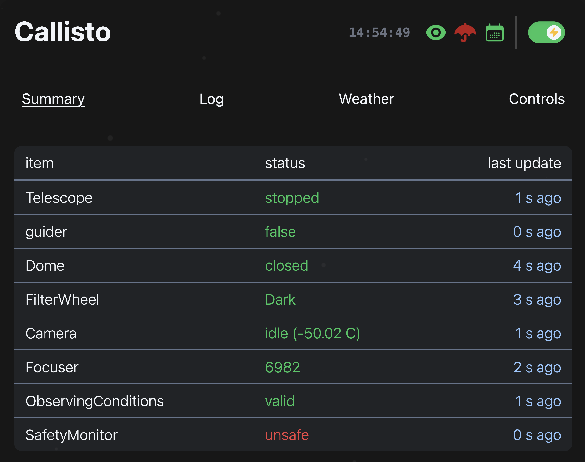

Operation Guide
================

Following :doc:`../getting_started`, `astra` has a few optional startup options:

.. code-block:: bash

   usage: astra [-h] [--debug] [--port PORT] [--truncate TRUNCATE] [--observatory {speculoos}] [--reset]

   Run Astra

   options:
      -h, --help            show this help message and exit
      --debug               run in debug mode (default: false)
      --port PORT           port to run the server on (default: 8000)
      --truncate TRUNCATE   truncate schedule by factor and reset time start time to now (default: None)
      --observatory {speculoos}
                              specify observatory name (default: None)
      --reset               reset the Astra's base config

In most cases, unless you're SPECULOOS or developing Astra, you will run without any options.

.. note:: SPECULOOS requires certain workarounds due to the quirks of its ASTELCO made observatory -- namely, custom error handling and some of its ASCOM methods not conforming asynchronous standards.

.. .. image:: ../_static/python_comms.svg
..    :width: 800px
..    :align: center
..    :alt: Astra web interface

.. logic, best practices, safety no. 1

Startup
-------

When Astra starts, it goes through three main phases: **initialization**, **device connection**, and **web interface**.

**1. Initialization**  
    - **Observatory Setup**: Reads the observatory configuration file.
    - **Database**: Creates (if it doesn't exist) a local SQLite database to store polled device data and logs.  
    - **Configuration**: Loads both observatory settings and FITS header configuration.
    - **Threads and Queues**: Starts a shared queue for managing communication between processes.  
    - **Flags**: Initializes status flags for watchdog, schedule, weather safety, and error free.  
    - **Schedule**: Checks for and loads an observation schedule, if available.  
    - **Devices**: Creates independent processes for each configured device.  

**2. Device Connection**  
    - **Connect Devices**: Each device process attempts to connect to its hardware. Successful connections are confirmed; failures are logged without blocking other devices.  
    - **Polling**: Starts automatic polling of device properties.
    - **Safety System**: Watchdog starts monitoring weather, device process health, and system status.  

**3. Web Interface**  
    - **FastAPI**: FastAPI UI and API are initialized.

Operation
---------

During operation, Astra's watchdog system continuously monitors all observatory components to ensure safe and efficient autonomous operation. The watchdog serves as the central control system that coordinates all observatory activities and maintains operational safety.

**Core Monitoring Functions**

The watchdog continuously monitors:

- **Safety and Weather**: Real-time weather conditions and safety monitor status
- **Device Health**: Communication status and responsiveness of all connected devices  
- **Error Management**: System errors, device failures, and automated recovery procedures
- **Schedule Coordination**: Observation timing, sequence execution, and schedule adherence
- **System Resources**: CPU usage, memory consumption, and disk space availability
- **Safety Boundaries**: Telescope altitude limits and operational safety constraints

**Automated Safety Actions**

The system automatically performs these protective actions:

- **Emergency Closure**: Immediately closes the observatory when unsafe conditions are detected
- **Schedule Management**: Starts and stops observation scheduling based on safety conditions
- **Error Recovery**: Handles system errors and device communication failures
- **Data Protection**: Performs daily database backups to prevent data loss
- **Health Reporting**: Updates system heartbeat for external monitoring systems

**Technical Operation Details**

The watchdog operates with a 0.5-second monitoring interval, providing rapid response to changing conditions. It coordinates seamlessly with the schedule runner to maintain autonomous operation while prioritizing safety.

.. note::
   The watchdog can be stopped by setting the ``watchdog_running`` flag to False. Upon exit, it automatically sets both ``schedule_running`` and ``robotic_switch`` to False, ensuring the system enters a safe state. The system handles both weather-dependent and weather-independent operations according to their specific safety requirements.

Safety
------

Safety is a top priority for Astra operations. The system is designed to prevent damage to equipment.

Weather Conditions
~~~~~~~~~~~~~~~~~

Astra continuously monitors weather conditions using the SafetyMonitor device and the internal safety monitor using the parameters from observatory configuration. 
The scheduler handles different action types based on weather dependency:

**Weather-dependent actions** (require safe conditions):
    - ``open``, ``object``, ``autofocus``, ``calibrate_guiding``, ``pointing_model``

**Weather-independent actions** (can run in unsafe weather):
    - ``calibration``, ``close``, ``cool_camera``, ``complete_headers``

If weather becomes unsafe during execution, weather-dependent actions will stop, while weather-independent actions continue. In either case, the observatory will close safely if needed.  The scheduler will also attempt to resume operations once conditions are safe again.

Troubleshooting
--------------

Common Issues
~~~~~~~~~~~

**Schedule not starting:**
    - Check that watchdog is running
    - Verify robotic switch is enabled
    - Ensure schedule end time is in the future
    - Confirm schedule file format is valid JSONL
    - **Verify camera device name exists in configuration**

**Actions skipping:**
    - Check weather conditions for weather-dependent actions
    - **Verify camera device name matches configuration exactly**
    - Review action parameters for correct format
    - Check for timing conflicts or overlaps
    - **Ensure camera has required paired devices configured**

**Incomplete sequences:**
    - Monitor error logs for device communication issues
    - Verify safety conditions throughout sequence
    - Check for sufficient time allocation between actions

**Invalid action parameters:**
    - Validate JSON syntax in action_value fields
    - Ensure required parameters are present
    - Check coordinate ranges and filter names